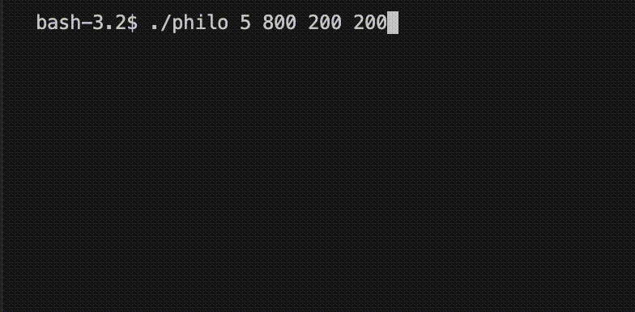

<!-- Improved compatibility of back to top link: See: https://github.com/othneildrew/Best-README-Template/pull/73 -->
<a name="readme-top"></a>

<!-- PROJECT LOGO -->
<br />
<div align="center">
  <a href="https://github.com/42sin/philosophers">
    
  </a>

<h3 align="center">Philosophers</h3>

  <p align="center">
    The Dining Philosopher Problem
    <br />
  </p>
</div>


<!-- TABLE OF CONTENTS -->
<details>
  <summary>Table of Contents</summary>
  <ol>
    <li>
      <a href="#about-the-project">About The Project</a>
    </li>
    <li><a href="#installation">Installation</a></li>
    <li><a href="#usage">Usage</a></li>
    <li><a href="#license">License</a></li>
  </ol>
</details>


<!-- ABOUT THE PROJECT -->
## About The Project

#### [Go to Subject PDF]
[![Subject PDF][subjectImage]](en.philo_subject.pdf)

This project is about the Dining Philosophers problem, which is a classic synchronization and concurrency problem that illustrates challenges in avoiding deadlock and ensuring the proper use of resources among multiple threads/processes. The challenge is to design a solution that avoids deadlock and ensures that philosophers can make progress without conflicts. There were several restrictions by the subject. The program must not have any data races, only a few standard library functions were allowed and the project must follow the 42 Norm. For more informations check out the <a href="en.philo_subject.pdf"> Subject PDF</a>.

<p align="right">(<a href="#readme-top">back to top</a>)</p>

<!-- GETTING STARTED -->
## Getting Started

### Installation

1. Clone the repo
   ```sh
   git clone https://github.com/42sin/philosophers.git && cd philosophers
   ```
2. Compile (philo for threads & mutexes/philo_bonus for processes & semaphores)
   ```sh
   cd philo && make
   ```
3. Run
   ```sh
   ./philosophers <number_of_philosophers> <time_to_die> <time_to_eat> <time_to_sleep>
   ```

<p align="right">(<a href="#readme-top">back to top</a>)</p>

<!-- USAGE EXAMPLES -->
## Usage

To run the program a few variables are needed:

1. number_of_philosophers: The amount of philosophers and also the number of forks.
2. time_to_die: In milliseconds, If a philosopher doesn’t start eating ’time_to_die’ milliseconds after starting their last meal or the beginning of the simulation, he dies.
3. time_to_eat: In milliseconds, The time it takes for a philosopher to eat. During that time they will need to keep their forks.
4. time_to_sleep: In milliseconds, The time the philosopher will spend sleeping.
5. <optional> number_of_times_each_philosopher_must_eat: If all philosophers eat at least ’number_of_times_each_philosopher_must_eat’ the simulation will stop. If not specified, the simulation will stop only at the death of a philosopher.
<br>
Each action of a philosopher will result in his state being printed with a timestamp and his number.<br>
A philosopher can:

- grab a fork
- eat
- sleep
- think
- die
<br>
Here is a basic example of a running simulation.



<p align="right">(<a href="#readme-top">back to top</a>)</p>

<!-- LICENSE -->
## License

Distributed under the MIT License. See `LICENSE` for more information.

<p align="right">(<a href="#readme-top">back to top</a>)</p>

<!-- MARKDOWN LINKS & IMAGES -->
[issues-url]: https://github.com/42sin/philosophers/issues
[license-url]: https://github.com/42sin/philosophers/blob/master/LICENSE
[subjectImage]: eval.png
[Go to Subject PDF]: en.philo_subject.pdf
